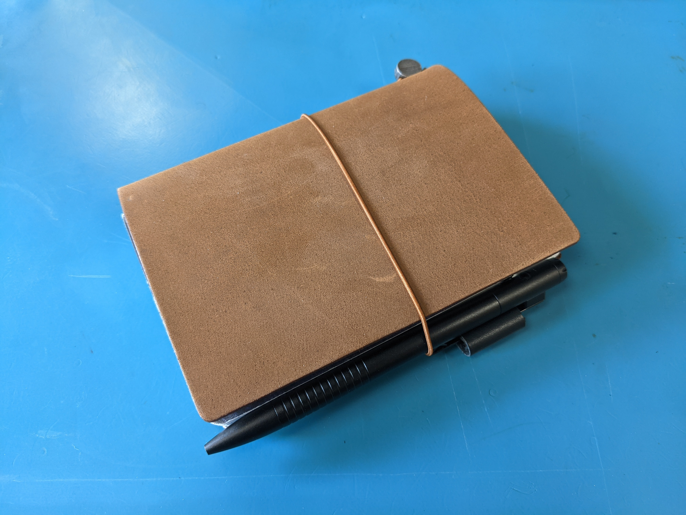

## WHY EVERYONE NEEDS A NOTEBOOK

A notebook is a blank canvas for any form of expression. You can write in it, you can draw in it, you can use it as a to-do list. The possibilities are *literally* endless. When I say notebooks, I mean physical notebooks. Not any digital note-taking apps. Don't get me wrong, I love Obsidian and I use it everyday, but I'm focusing on physical, analog notebooks in this post.

Removing the need for electricity when wanting to write in a notebook also removes the barrier of when and where you can use it and removes any distractions from the endless abyss our digital devices can subject us to. 

This allows me to spend dedicated time to thinking *just* about my thoughts, rather than thinking about my thoughts whilst watching a YouTube video, checking Reddit and adjusting my Polybar config.

If you're like me and are constantly thinking about multiple things, sometimes leading to you getting overwhelmed, getting them out of your head and onto paper - into the real world, lets you explore them from different angles.

That may sound a bit self-helpy, but I've found not only has writing allowed me to think about *how I think* a bit better, it's also improved my productivity - writing notes by hand actually helps you remember more of what you're writing. 

A [study](https://www.frontiersin.org/journals/psychology/articles/10.3389/fpsyg.2023.1219945/full) by F. R. (Ruud) van der Weel and Audrey van der Meer at the Norwegian University of Science and Technology goes into detail about how when writing by hand, each motion is unique to different letters whereas typing on a keyboard only has a single motion for each key.

They conducted an experiment on 36 students in their early 20s where they flashed certain words in front of them for a few seconds. They asked the students to write out half by hand and type half on a keyboard. All the students had electrodes on their scalps to monitor their brain's electrical signals and they found that there was increased connectivity between the central parts of the brain and the parietal lobe in the outer part of the brain when writing by hand as oppose to typing.

## MY PERSONAL SETUP

Okay, science stuff out the way, how do we set this up to work?

I personally like to keep mine small, I won't go above A5 in size, and most of the time I use a pocket notebook (more about this later). 

Currently, I have two notebooks in a pocket organiser (seriously, great for organising). One is for the need of paper whenever it is required. Basically for my to-dos, things I want to remember, any interesting ideas I think of, any conversational topics I find interesting, etc.

The second book is my quick sketchbook, this is used to quickly capture ideas that spring in and out of my head as drawings. This could be things like interesting mechanisms, interesting objects, doodles, possible sculpture ideas. Anything where a visual aid is advantageous to get the idea across - which can also be easier to capture than writing it out.

It also allows me to work on my interests anywhere and at anytime. I'm looking into how art and science are more closely related than we might expect, so my sketchbook is used for ideation of new concepts I want to explore further in a larger sketchbook.

## WHY WASTE YOUR MONEY, MAKE YOUR OWN NOTEBOOKS!

I used to collect lots of Field Notes® notebooks and realised how I had just fallen into the consumer trap. Lots of cool pictures of people's EDC setups on [r/EDC](https://www.reddit.com/r/EDC/) led me to believe I needed that little notebook in my arsenal. When I saw that 3 notebooks cost me almost 15 quid, I instantly looked for alternatives.

Making your own notebooks is stupidly easy. All you need is paper, some card and 2 paperclips.

I'm planning on making a video soon on how I make my own notebooks, so do look out for that on my [YouTube](https://www.youtube.com/@tamirrxyz) channel, but all you need to do is put some sheets together, cut them down to size, fold them in half and then plop two staples in the fold crease. Congratulations, you can now make and infinite number of notebooks.